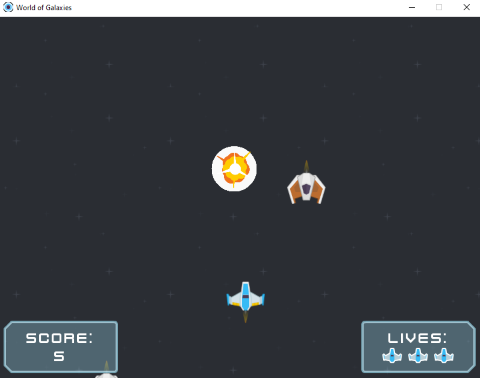

# World of Galaxies
Dobrodružství v tradiční 2D vertical scrolling shooter hře.
Ztracená vesmírná loď v jedné z galaxií nekonečného vesmíru.
Úkolem lodi je uniknout z této galaxie a vypořádat se s nepřátelskými loděmi a vysokým výskytem meteoritů.
Loď má vysoce účinný laser, kterým jednoduše ničí vše okolo.

**Cíl hry:** Získat co největší skóre.

## Obsah
* [Specifikace](#specifikace)
* [Ovládání](#ovládání)
* [Dokumentace](#dokumentace)

## Specifikace

- **Typ:** 2D vertical scrolling shooter
- **Cílová platforma:** PC windows
- **Cílová skupina hráčů:** casual
- **Programovací jazyk:** Python
- **Knihovna:** [PyGame](https://www.pygame.org/)


## Ovládání

- **Pohyb:** WSAD nebo šipky
- **Střelba:** mezerník
- **ESC:** ukončení hry (návrat do menu)

## Dokumentace

Obrázek hlávního menu:


Obrázek ze hry:



### Soubor `Main.py`

Na začátku souboru probíhá inicializace knihovny **PyGame**, nastavení herního okna a nalezení
cesty ke složce **content**.

```python
ROOT_PATH = dirname(dirname(__file__))  # získání cesty ke "content" složce

# metoda vrátí cestu k danému obsahu
def get_content(name_content):
    return os.path.join(os.path.join(ROOT_PATH, "content"), name_content)

WIDTH_WIN = 800  # šířka herního okna
HEIGHT_WIN = 600 # výška herního okna

pygame.init()
WINDOW = pygame.display.set_mode((WIDTH_WIN, HEIGHT_WIN)) # nastavení velikosti herního okna
pygame.display.set_caption("World of Galaxies") # titulek okna
icon_img = pygame.image.load(get_content("icon.png")) # ikona herního okna
pygame.display.set_icon(icon_img)
FPS = 120
FPS_CLOCK = pygame.time.Clock()
```

Hra je rozdělana do dvou hlavních funkcí:

1. **main_menu()**
    - funkce vytváří, aktualizuje a vykresluje hlavní menu
    ```python
    def main_menu():
        # načtení obsahu pro hlavní menu
        background_img = pygame.image.load(get_content("menu/bg_menu.png"))
        bg_panel_img = pygame.image.load(get_content("menu/bg_panel_01.png"))
        bg_panel_score_img = pygame.image.load(get_content("menu/bg_panel_02.png"))
        button_blue_img = pygame.image.load(get_content("menu/button_blue.png"))
        button_yellow_img = pygame.image.load(get_content("menu/button_yellow.png"))
    
        # vytvoření UI komponent
        size_text = title_font.size("World of Galaxies")
        title_text = UIText("World of Galaxies", title_font, (WIDTH_WIN / 2) - (size_text[0] / 2), 40)
        panel_x = (WIDTH_WIN / 2) - (bg_panel_img.get_width() / 2)
        panel_y = (HEIGHT_WIN / 2) - (bg_panel_img.get_width() / 2) - 50
        btn_play = UIButton("Play", ui_font, button_blue_img, button_yellow_img, panel_x + 20, panel_y + 20, game)
        btn_quit = UIButton("Quit", ui_font, button_blue_img, button_yellow_img,
                            panel_x + 20,
                            btn_play.get_y() + button_blue_img.get_height() + 10,
                            quit_game
                            )
        panel_score_x = panel_x
        panel_score_y = panel_y + bg_panel_img.get_height() + 10
        size_text = ui_font.size("TOP Score")
        top_score_title = UIText("TOP Score", ui_font,
                                 (WIDTH_WIN / 2) - (size_text[0] / 2),
                                 panel_score_y + 20,
                                 BLACK_COLOR
                                 )
        score = str(read_score_from_file(SCORE_FILE))
        size_text = ui_font.size(score)
        score_value_text = UIText(score, ui_font,
                                  (WIDTH_WIN / 2) - (size_text[0] / 2),
                                  top_score_title.get_y() + size_text[1] + 10,
                                  BLACK_COLOR
                                  )
    
        # hlavní smyčka menu
        while True:
            # input eventy
            for event in pygame.event.get():
                if event.type == pygame.QUIT:
                    pygame.quit()
                    sys.exit()
    
            # vykreslení pozadí
            WINDOW.blit(background_img, (0, 0))
    
            # aktualizování UI komponent
            btn_play.update()
            btn_quit.update()
    
            # vykreslení UI komponent
            title_text.draw(WINDOW)
            WINDOW.blit(bg_panel_img, (panel_x, panel_y))
            btn_play.draw(WINDOW)
            btn_quit.draw(WINDOW)
            WINDOW.blit(bg_panel_score_img, (panel_score_x, panel_score_y))
            top_score_title.draw(WINDOW)
            score_value_text.draw(WINDOW)
    
            pygame.display.update()
    ```
2. **game()**
    - funkce vytváří, aktualizuje a vykresluje herní scénu
    ```python
    def game():
    # sprite groups
    components = pygame.sprite.Group()  # všechny komponenty ve hře
    enemies = pygame.sprite.Group()  # všichni nepřátelé ve hře
    meteors = pygame.sprite.Group()  # všechny meteority ve hře
    player_lasers = pygame.sprite.Group()  # všechny lasery hráče ve hře
    enemies_lasers = pygame.sprite.Group()  # všechny lasery nepřátel ve hře

    # načtení obsahu pro hru
    background_img = pygame.image.load(get_content("background.png"))
    bg_panel_score_img = pygame.image.load(get_content("bg_panel_score.png"))
    bg_panel_lives_img = pygame.image.load(get_content("bg_panel_lives.png"))
    player_img = pygame.image.load(get_content("player.png"))
    player_laser_img = pygame.image.load(get_content("player_laser.png"))
    player_life_img = pygame.image.load(get_content("player_life.png"))
    enemy_img = pygame.image.load(get_content("enemy.png"))
    meteor_img = pygame.image.load(get_content("meteorite.png"))
    enemy_laser_img = pygame.image.load(get_content("enemy_laser.png"))
    explosion_sprites = []
    for i in range(9):
        name_img = "regularExplosion0{}.png".format(i)
        path_to_img = "explosion/{}".format(name_img)
        img = pygame.image.load(get_content(path_to_img)).convert()
        img.set_colorkey((0, 0, 0)) # černá brava
        mod_img = pygame.transform.scale(img, (75, 75))
        explosion_sprites.append(mod_img)
    explosion_sound = pygame.mixer.Sound(get_content("sounds/explosion.wav"))
    laser_sound = pygame.mixer.Sound(get_content("sounds/laser1.wav"))
    laser_sound.set_volume(.3)

    # vytvoření herních komponent
    background = Background(BG_SCROLLING_SPEED, 0, 0, background_img)
    player_x = (WIDTH_WIN // 2) - player_img.get_width() // 2
    player_y = HEIGHT_WIN - 200
    player = Player(
        PLAYER_HEALTH,
        PLAYER_SPEED,
        PLAYER_SHOOT_DELAY,
        player_x,
        player_y,
        player_img,
        player_laser_img,
        explosion_sprites,
        laser_sound,
        explosion_sound
    )
    components.add(player)

    # vytvoření UI pro hru
    panel_score_x = 8
    panel_score_y = HEIGHT_WIN - bg_panel_score_img.get_height() - 8
    size_text = ui_font.size("Score:")
    score_title = UIText("Score:", ui_font,
                         panel_score_x + (bg_panel_score_img.get_width() / 2) - (size_text[0] / 2),
                         panel_score_y + 15
                         )
    size_text = ui_font.size(str(player.get_score()))
    score_text = UIText(str(player.get_score()), ui_font,
                        panel_score_x + (bg_panel_score_img.get_width() / 2) - (size_text[0] / 2),
                        panel_score_y + 45
                        )
    panel_lives_x = WIDTH_WIN - bg_panel_lives_img.get_width() - 8
    panel_lives_y = HEIGHT_WIN - bg_panel_lives_img.get_height() - 8
    size_text = ui_font.size("Lives:")
    lives_title = UIText("Lives:", ui_font,
                         panel_lives_x + (bg_panel_lives_img.get_width() / 2) - (size_text[0] / 2),
                         panel_lives_y + 15
                         )
    player_hud = PlayerHUD(player.get_health(), player_life_img, panel_lives_x + 35, panel_lives_y + 45)

    # generátor nepřátel a meteoritů
    generator = EnemiesAndMeteoritesGenerator(ENEMIES_GEN,METEORITES_GEN,explosion_sprites,explosion_sound)

    # hlavní smyčka hry
    while True:
        # input eventy
        for event in pygame.event.get():
            if event.type == pygame.QUIT:
                pygame.quit()
                sys.exit()
            if event.type == pygame.KEYDOWN and event.key == pygame.K_ESCAPE:
                main_menu()

        # scrollování pozadí
        background.scrolling(HEIGHT_WIN)

        # generování nepřátel a meteoritů
        generator.generate_enemy(enemy_img, enemy_laser_img, laser_sound, WIDTH_WIN, components, enemies)
        generator.generate_meteorite(meteor_img, WIDTH_WIN, components, meteors)

        # aktualizování herních komponent
        for component in components:
            if isinstance(component, Player):
                component.update(WIDTH_WIN, components, player_lasers, enemies, enemies_lasers, meteors)
            elif isinstance(component, Enemy):
                component.update(HEIGHT_WIN, components, enemies_lasers)
            elif isinstance(component, Meteorite):
                component.update(HEIGHT_WIN)
            elif isinstance(component, Laser):
                component.update(HEIGHT_WIN)
            else:
                component.update()

        # vykreslení herních komponent a UI
        background.draw(WINDOW)
        components.draw(WINDOW)
        WINDOW.blit(bg_panel_score_img, (panel_score_x, panel_score_y))
        WINDOW.blit(bg_panel_lives_img, (panel_lives_x, panel_lives_y))
        score_title.draw(WINDOW)
        lives_title.draw(WINDOW)
        update_and_draw_ui(score_text, panel_score_x, bg_panel_score_img, player_hud, player)

        # kontrola, jestli je hráč mrtvý
        if player.is_death():
            write_score_to_file(player.get_score(), SCORE_FILE) # uložení score do souboru
            game_over_menu()    # spuštění game over menu

        FPS_CLOCK.tick(FPS)
        pygame.display.update()
    ```
  
Funkce **game_over_menu()** slouží pro vytvoření, aktualizování a vykreslení menu
v případě, že hráč prohrál:

```python
def game_over_menu():
    # načtení obsahu pro game over menu
    bg_panel_img = pygame.image.load(get_content("menu/bg_panel_01.png"))
    button_blue_img = pygame.image.load(get_content("menu/button_blue.png"))
    button_yellow_img = pygame.image.load(get_content("menu/button_yellow.png"))

    # vytvoření UI komponent
    size_text = title_font.size("Game Over")
    game_over_text = UIText("Game Over", title_font, (WIDTH_WIN / 2) - (size_text[0] / 2), (HEIGHT_WIN / 2) - 150)
    panel_x = (WIDTH_WIN / 2) - (bg_panel_img.get_width() / 2)
    panel_y = (HEIGHT_WIN / 2) - (bg_panel_img.get_height() / 2)
    btn_again = UIButton("Again", ui_font, button_blue_img, button_yellow_img, panel_x + 20, panel_y + 20, game)
    btn_menu = UIButton("Menu", ui_font, button_blue_img, button_yellow_img,
                        panel_x + 20,
                        btn_again.get_y() + button_blue_img.get_height() + 10,
                        main_menu
                        )

    # hlavní smyčka menu
    while True:
        # input eventy
        for event in pygame.event.get():
            if event.type == pygame.QUIT:
                pygame.quit()
                sys.exit()

        # aktualizování UI komponent
        btn_again.update()
        btn_menu.update()

        # vykreslení UI komponent
        game_over_text.draw(WINDOW)
        WINDOW.blit(bg_panel_img, (panel_x, panel_y))
        btn_again.draw(WINDOW)
        btn_menu.draw(WINDOW)

        pygame.display.update()
```

Funkce pracují v následujícím pořadí:

1. Načtení obsahu
2. Vytvoření komponent
3. Smyčka
    - zachycení vstupů
    - aktualizování komponent
    - vykreslení komponent

### Soubor `GameClasses.py`

Soubor obsahuje všechny potřebné třídy a konstanty pro hru.

#### Třída `Component`

Tato třída je odvozená od třídy **pygame.sprite.Sprite**

**Component** je základní třídou pro následující objekty:

- Ship (Player, Enemy)
- Laser
- Meteorite

##### Parametry
- **init:**
    - **start_x** - x-ová startovní pozice komponenty
    - **start_y** - y-ová startovní pozice komponenty
    - **img** - obrázek komponenty

Mimo funkcí, které vrací ohraničení, pozici, šířku, výšku a obrázek komponenty, 
obsahuje funkci pro vytvoření efektu exploze:

```python
    def explode(self, components):
        self.explosion = Explosion(
            (self.get_x() + self.image.get_width() / 2, self.get_y() + self.image.get_height() / 2),
            self.explosion_sprites,
            EXPLOSION_FRAME_RATE
        )
        components.add(self.explosion)
        pygame.mixer.Sound.play(self.explosion_sound)
```

#### Třída `Background`

Třída se stará o vykreslení scrollovacího pozadí hry.

##### Parametry
- **init:**
    - **scrolling_speed** - rychlost scrollování pozadí
    - **start_x** - x-ová startovní pozice komponenty
    - **start_y** - y-ová startovní pozice komponenty
    - **img** - obrázek komponenty

Funkce pro scrollování:
```python
    def scrolling(self, height_win):
        if self.pos_y < height_win:
            self.pos_y += self.scrolling_speed
        else:
            self.pos_y = 0
```

Funkce pro vykreslení:
```python
    def draw(self, win):
        win.blit(self.img, (self.pos_x, self.pos_y))
        win.blit(self.img, (self.pos_x, -self.img.get_height() + self.pos_y))
```

#### Třída `Ship`

Třída, která určuje základní vlastnosti vesmírné lodi, jako jsou:

- životy
- rychlost
- rychlost střelby

Tahle třída je základní třídou následujících objektů:

- Player
- Enemy

##### Parametry
- **init:**
    - **health** - životy lodě
    - **speed** - rychlost lodě
    - **shoot_delay** - rychlost střílení (v ms)
    - **laser_img** - obrázek laseru
    - **explosion_sprites** - sprity exploze
    - **laser_sound** - zvuk výstřelu
    - **explosion_sound** - zvuk exploze

#### Třída `Player`

Ve funkci **update** probíhá ovládání hráče, rozesílání polohy všem nepřátel, kontrola kolizí
a kontrola úmrtí hráče

##### Parametry
Stejné jako ve třídě **Ship**

Ovládání hráče:
```python
        keys = pygame.key.get_pressed()
        if keys[pygame.K_d] or keys[pygame.K_RIGHT]:
            self.add_x(self.speed)
        elif keys[pygame.K_a] or keys[pygame.K_LEFT]:
            self.add_x(-self.speed)
        elif keys[pygame.K_s] or keys[pygame.K_DOWN]:
            self.add_y(self.speed)
        elif keys[pygame.K_w] or keys[pygame.K_UP]:
            self.add_y(-self.speed)
        if keys[pygame.K_SPACE]:
            self.shoot(components, player_lasers)
```

Kontrola kolizí s nepřátelskámi loďmi, laserama nepřátel a meteority:
```python
        self.check_collide_with_enemy(enemies)
        self.check_collide_with_meteorite(meteors, components)
        self.check_collide_with_enemy_laser(enemies_lasers)
        self.check_collide_player_laser_with_enemy(player_lasers, enemies)
        self.check_collide_player_laser_with_meteorite(player_lasers, meteors, components)
```

Funkce pro střelbu. Hráč střílí v daných intervalech, dle parametru **shoot_delay**.
```python
    def shoot(self, components, player_lasers):
        time_now = pygame.time.get_ticks()
        if time_now - self.last_shot > self.shoot_delay:
            self.last_shot = time_now
            x = (self.get_x() + self.image.get_width() // 2) - self.laser_img.get_width() // 2
            y = self.get_y() - self.laser_img.get_height()
            laser = Laser(PLAYER_LASER_SPEED, PLAYER_LASER_DAMAGE, -1, x, y, self.laser_img)
            components.add(laser)
            player_lasers.add(laser)
            pygame.mixer.Sound.play(self.laser_sound)
```

#### Třída `Enemy`

Třída pro nepřátelskou loď je podobná třídě **Player** s tím rozdílem, že si nekontroluje kolize.

##### Parametry
Stejné jako ve třídě **Ship**

Funkce **update()**:
```python
    def update(self, height_win, components, enemies_lasers):
        self.add_y(self.speed)
        self.shoot(components, enemies_lasers)

        # kontrola úmrtí
        if self.get_health() <= 0:
            self.explode(components)
            self.kill()

        # pokud je nepřítel mimo obrazovku, zničí se
        if self.get_rect().top > height_win:
            self.kill()
```

#### Třída `Laser`

Třída laseru pro hráčovu a nepřátelskou loď

##### Parametry
- **init:**
    - **speed** - rychlost laser
    - **damage** - poškození laseru
    - **direction** - směr letu laser ("1" - dolů, "-1" - nahoru)

Funkce **update()**:
```python
    def update(self, height_win):
        self.add_y(self.speed * self.direction)

        # pokud je laser mimo obrazovku, tak se zničí
        if self.get_rect().bottom < 0 or self.get_rect().top > height_win:
            self.kill()
```

#### Třída `Meteorite`

Meteorit je rotující objekt.

##### Parametry
- **init:**
    - **speed** - rychlost meteoritu
    - **laser_img** - obrázek laseru
    - **explosion_sprites** - sprity exploze
    - **explosion_sound** - zvuk exploze

Funkce **update()**:
```python
    def update(self, height_win):
        self.add_y(self.speed)

        self.image = pygame.transform.rotate(self.original_image, self.angle) # rotace obrázku
        self.angle = (self.angle + 1) % 360  # nový úhel

        # pokud je meteorit mimo obrazovku, zničí se
        if self.get_rect().top > height_win:
            self.kill()
```

#### Třída `EnemiesAndMeteoritesGenerator`

Třída se stará o vygenerování nepřátelských lodí a meteoritů.

##### Parametry
- **init:**
    - **enemy_gen_delay** - rychlost generování nepřátelských lodí (v ms)
    - **meteor_gen_delay** - rychlost generování meteoritů (v ms)
    - **explosion_sprites** - sprity exploze
    - **explosion_sound** - zvuk exploze

Generování meteoritů:
```python
    def generate_meteorite(self, meteor_img, width_win, components, meteors):
        time_now = pygame.time.get_ticks()
        if time_now - self.last_meteorite_gen > self.meteor_gen_delay:
            self.last_meteorite_gen = time_now
            x = random.randrange(width_win - meteor_img.get_width())
            y = -(meteor_img.get_height() + 10)
            meteorite = Meteorite(METEORITE_SPEED, x, y, meteor_img, self.explosion_sprites, self.explosion_sound)
            components.add(meteorite)
            meteors.add(meteorite)
```

Generování nepřátelských lodí:
```python
    def generate_enemy(self, enemy_img, enemy_laser_img, laser_sound, width_win, components, enemies):
        time_now = pygame.time.get_ticks()
        if time_now - self.last_enemy_gen > self.enemy_gen_delay:
            self.last_enemy_gen = time_now
            x = random.randrange(width_win - enemy_img.get_width())
            y = -(enemy_img.get_height() + 10)
            enemy = Enemy(
                ENEMY_HEALTH,
                ENEMY_SPEED,
                ENEMY_SHOOT_DELAY,
                x,
                y,
                enemy_img,
                enemy_laser_img,
                self.explosion_sprites,
                laser_sound,
                self.explosion_sound
            )
            components.add(enemy)
            enemies.add(enemy)
```

#### Třída `Explosion`

Třída pro efekt exploze hráče, nepřátelských lodí a meteoritů

##### Parametry
- **init:**
    - **center** - střed vzniku exploze
    - **explosion_sprites** - sprity exploze
    - **explosion_sound** - zvuk exploze
    - **frame_rate**- rychlost animace exploze (v ms)

Funkce **update()**:
```python
    def update(self, *args):
        now = pygame.time.get_ticks()
        if now - self.last_update > self.frame_rate:
            self.last_update = now
            self.frame += 1
            if self.frame == len(self.explosion_sprites): # pokud bude poslední sprite efektu, celý efekt se zničí
                self.kill()
            else: # jinak pokračuj na další sprite efektu
                center = self.rect.center
                self.image = self.explosion_sprites[self.frame]
                self.rect = self.image.get_rect()
                self.rect.center = center
```
    
### Soubor `UIClasses.py`

Soubor obsahuje třídy pro **User Interface**.

#### Třída `UIComponent`

**UIComponent** je základní třídou pro následující objekty:

- UIText
- UIImage
- UIButton
- UIButton
- PlayerHUD

##### Parametry
- **init:**
    - **pos_x** - x-ová pozice UI komponenty
    - **pos_y** - y-ová pozice UI komponenty
    
#### Třída `UIText`

Třída pro vykreslení textu.

##### Parametry
- **init:**
    - **text** - zobrazovaný text
    - **font** - font textu
    - **color** - barva textu (výchozí je černá)
    
#### Třída `UIImage`

Třída pro vykreslení obrázku.

##### Parametry
- **init:**
    - **img** - obrázek k vykreslení
    
#### Třída `UIButton`

Třída pro tlačítko.

##### Parametry
- **init:**
    - **text** - text na tlačítku
    - **font** - font textu na tlačítku
    - **img_inactive** - obrázek tlačítka, pokud není kurzor nad tlačítkem
    - **img_hover** - obrázek tlačítka, po najetí kurzoru nad tlačítko
    - **clicked** - do parametru lze uložit metodu s danou funkčností a po kliknutí na tlačítko se metoda vykoná

Funkce **update()**:
```python
    def update(self):
        mouse = pygame.mouse.get_pos()
        self.last_click = self.click
        self.click = pygame.mouse.get_pressed()
        # pokud je kurzor myši na tlačítku
        if self.pos_x + self.img.get_width() > mouse[0] > self.pos_x and \
                self.pos_y + self.img.get_height() > mouse[1] > self.pos_y:
            self.img = self.img_hover # změň obrázek tlačítka
            # pokud je stisknuto levé tlačítko myši a event "clicked()" není None, spusť event "clicked()"
            if (self.click[0] == 1 and self.last_click[0] == 0) and self.clicked is not None:
                self.clicked()
        else: # jinak přepni obrázek tlačítka zpět na defaultní
            self.img = self.img_inactive
```

#### Třída `PlayerHUD`

Třída pro zobrazení životů hráče.

##### Parametry
- **init:**
    - **number_lives** - počet životů
    - **img_health** - obrázek jednoho životu

Funkce **update()**:
```python
    # funkce aktualizuje počet životů hráče v UI
    def update_lives(self, lives):
        del_lives = self.number_lives - lives
        if del_lives <= len(self.ui_images) - 1:
            for _ in range(0, del_lives):
                self.ui_images.pop(-1)
                self.number_lives -= 1
        else:
            self.ui_images.clear()
```